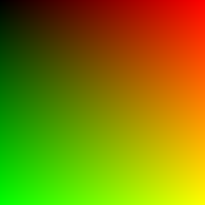

# Ray Tracing

The following steps will help you build this project and preview the current image.

- Step 0: Install CMake. For macOS, run
    ```
    brew update && brew install cmake
    ```

- Step 1: First, we enter the directory `build`.
    ```
    cd build
    ```

- Step 2: Specify the target for CMake.
    ```
    cmake ../src
    ```

- Step 3: Build the project.
    ```
    cmake --build .
    ```

- Step 4: Execute and redirect the output to `image.ppm`.
    ```
    ./RayTracing > image.ppm
    ```

- Step 5: Find the file `image.ppm` in the folder, double-click it, and you can see the current image.
    
